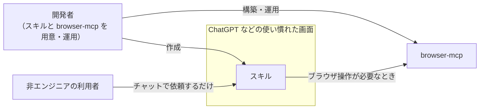

# browser-mcp

Playwright で動く「本物のブラウザ」を、**リモートから MCP（Model Context Protocol）で使えるようにするサーバー**。
自分ではブラウザを動かせない LLM 環境（ChatGPT など）に、ブラウザ操作の手段を提供します。

> ステータス: 構想・設計段階（実装前）

## 背景・課題

### 誰のためのものか

昨今の日本では、どの業界も人手不足が深刻です。
限られた人数で日々の業務を回すことに精一杯で、現場には新しいことを学ぶ余裕がほとんどありません。

一方で、業務効率化のために DX（デジタルトランスフォーメーション）が求められています。
しかし、次々と出てくる新しいツールや AI をキャッチアップすること自体が、現場の人にとって大きなストレスになっています。
**業務を楽にするための DX が、かえって負担を増やしてしまう**という状況です。

AI の分野でも同じことが言えます。
Claude Code などの CLI ツールを使えば、ブラウザ操作を含む業務の自動化はすでに可能です。
しかし、非エンジニアなど IT リテラシーが高くない人にとっては、

- ターミナルや CLI ツールを使うこと自体のハードルが高い
- 環境構築や使い方を覚えるキャッチアップコストがかかる

という問題があり、そこまでは求められていません。
**必要なのは、新しいことを覚えなくても、今のやり方のまま業務が楽になること**です。
そこで、**普段使っている ChatGPT などの上に「スキル」を用意し、使い慣れた画面のまま業務を効率化できるようにしたい**、というのが出発点です。

利用者はチャットで依頼するだけで、スキルの作成や仕組みの用意は開発者が引き受けます。
業務ごとにスキルを作って提供していけば、**世の中のさまざまな業務の効率化を進められる**のではないかと思っています。

### ぶつかった問題

ところが、ChatGPT Work などの AI サービスでも、スキルだけでは達成できない業務があります。
その一つとして、**ブラウザ操作**があります。

簡単なブラウザ操作であれば、サービスに組み込まれたクラウドブラウザでも可能です。
しかし、次のような制約があり、実際の業務では対応しきれない場面があります。

- **組み込みのクラウドブラウザでは扱えないサイトがある**
  例えば ChatGPT のクラウドブラウザでは、WebGL を使うサイトを表示できず、必要な情報を取得できないことがある。
- **Playwright などのブラウザ自動化ツールを自分で動かせない**
  コード実行サンドボックスにはブラウザが入っておらず、自由にインストールもできない。

つまり、「スキルを提供して業務を効率化する」という考え方を広げていくうえで、**ブラウザ操作が壁になっている**状態です。
この壁を取り除く手段として、学習も兼ねて `browser-mcp` を自作します。

## このプロジェクトの狙い

1. **ホスト型 LLM 環境から、ブラウザを操作できるようにする**（本プロジェクトの主目的）
2. **利用者に技術的な作業をさせない**
   利用者はチャットで依頼するだけ。インストールや設定などの作業は開発者側で完結させる。
3. **安全性・制御**
   特定の利用者だけが使えるよう、OAuth で認証する。
4. **トークン効率**
   LLM に渡すページ情報を必要十分な量に絞り、コンテキストを無駄に消費しない。
5. **学習・ポートフォリオ**
   MCP・ブラウザ自動化・リモートサーバー運用を一通り設計・実装する。

## 利用想定

| 項目 | 内容 |
| --- | --- |
| 主な利用元 | ChatGPT など、自前でブラウザを動かせない LLM 環境 |
| 想定利用者 | 非エンジニアなど、CLI ツールを使わない人（スキル経由で利用） |
| 利用範囲 | 許可した特定の利用者のみ（一般公開しない） |

## ドキュメント

- [アーキテクチャ](docs/architecture.md): 全体構成、技術構成、認証の流れ
- [MCP 勉強ノート](docs/mcp-study/README.md): MCP の概念と構成
