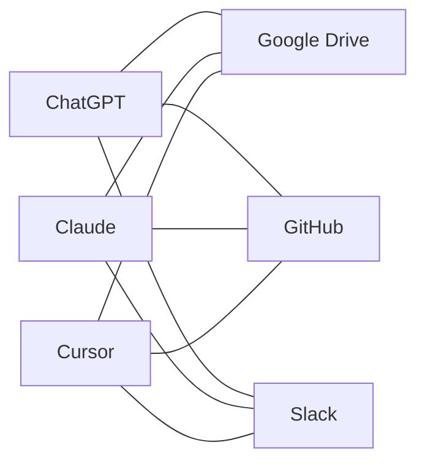
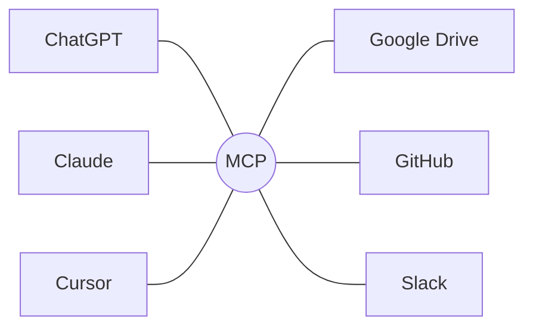

# 01. MCP とは何か

## ひとことで

**LLM アプリと、外部のツールやデータをつなぐための共通ルール**です。

よく「AI のための USB-C」と例えられます。
USB-C があれば、どのメーカーのパソコンにも同じケーブルで機器をつなげます。
同じように MCP に対応していれば、どの LLM アプリにも同じ方法で機能を追加できます。

## LLM だけではできないこと

LLM は文章を考えるのは得意ですが、それだけでは次のようなことができません。

- 最新の情報や社内のデータを見る
- ファイルを保存する、メールを送る
- 外部のサービス（GitHub、Slack など）を使う

これらを実現するには、LLM に外部とつながる手段を渡す必要があります。

## MCP がない世界の問題

MCP ができる前は、LLM アプリごとに連携の作り方がバラバラでした。

アプリが 3 つ、連携先が 3 つなら、**3 × 3 = 9 通り**の作り込みが必要です。
アプリや連携先が増えるほど、組み合わせは爆発的に増えます。

## MCP がある世界

アプリは「MCP に対応する」、連携先は「MCP サーバーを作る」だけで済みます。
必要な作業は **3 + 3 = 6 通り**になり、一度作ったサーバーはどのアプリからも使えます。

## 似ているもの

MCP は、プログラミングの世界の **LSP（Language Server Protocol）** を参考にしています。
LSP のおかげで、1 つの言語サポート（補完やエラー表示）を VS Code でも Vim でも使えるようになりました。
MCP はその「AI アプリ版」と考えると分かりやすいです。

## まとめ

- MCP は、LLM アプリに外部の機能をつなぐための**共通ルール**
- 「アプリ × 連携先」の組み合わせ問題を「アプリ + 連携先」に減らす
- 一度 MCP サーバーを作れば、対応しているどのアプリからでも使える
