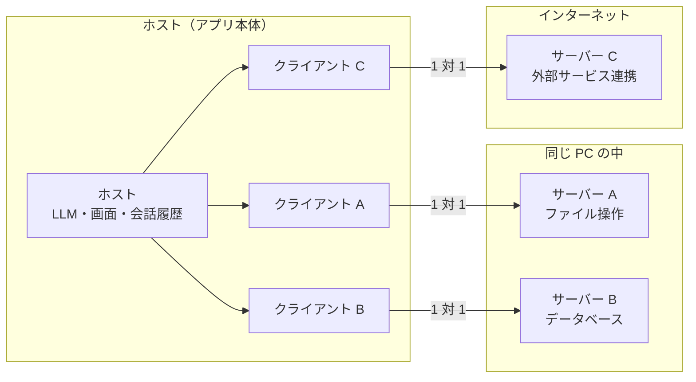
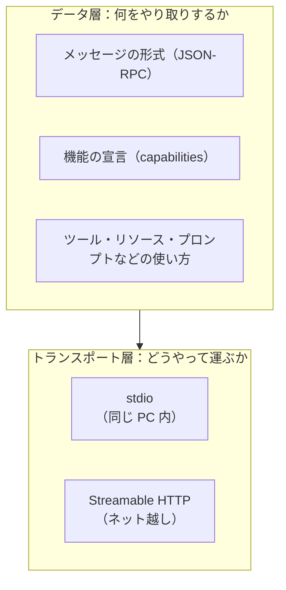
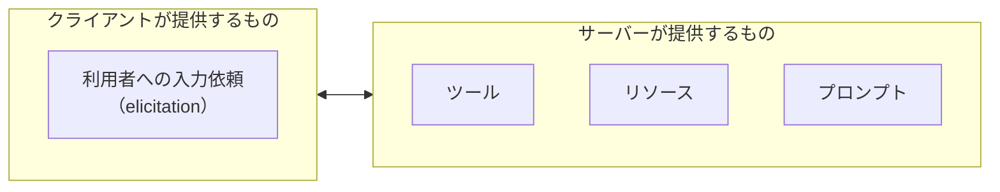

# 02. 全体の構成

MCP の構成は、次の 2 つの見方で理解できます。

1. **登場人物**：誰と誰がつながっているか（ホスト・クライアント・サーバー）
2. **層**：やり取りが「中身」と「運び方」の 2 層に分かれている

## 1. 登場人物

### ホスト（Host）

**LLM アプリ本体**です。Claude Desktop、ChatGPT、Cursor などがこれにあたります。

- 利用者の画面と、LLM と、会話の履歴を持つ
- どのサーバーにつなぐかを管理し、サーバーごとにクライアントを作る
- ツールを実行してよいか、利用者に確認する
- 複数のサーバーから得た情報をまとめて LLM に渡す

### クライアント（Client）

**ホストの中にいる接続係**です。

- **1 つのクライアントは、1 つのサーバーとだけ**やり取りする
- サーバーを 3 つつなげば、ホストの中にクライアントが 3 つできる

### サーバー（Server）

**機能やデータを提供する側**です。

- ツール・リソース・プロンプト（03 章）を提供する
- 1 つのサーバーは 1 つの分野に集中する
- **ローカル**（同じ PC で動くプログラム）でも、**リモート**（ネット上のサービス）でもよい

## なぜこう分かれているのか

### サーバーを簡単に作れるようにするため

LLM とのやり取りや、どのツールを使うかの判断は、すべてホストが担当します。
サーバーは「頼まれたことを実行して結果を返す」ことだけ考えればよくなります。

### サーバー同士を隔離するため

クライアントとサーバーが 1 対 1 なので、

- サーバーは**会話全体を見られない**（必要な情報だけが渡される）
- サーバーは**他のサーバーの情報を見られない**

という状態が保たれます。

### 組み合わせて使えるようにするため

1 つのサーバーは 1 つの役割に絞り、必要なものを複数つなぐ、という使い方ができます。
例えば「GitHub のサーバー」と「Slack のサーバー」を両方つなげば、「新しい Issue を Slack に投稿する」ことができます。

## 2. 2 つの層

MCP のやり取りは、**中身（データ層）**と**運び方（トランスポート層）**の 2 層に分かれています。

| 層 | 決めていること | 例え |
| --- | --- | --- |
| **データ層** | どんなメッセージを、どんな形式で送るか | 手紙の**書き方** |
| **トランスポート層** | そのメッセージを、どうやって相手に届けるか | 手紙を**手渡しするか、郵便で送るか** |

層が分かれているので、**同じ中身を、ローカルでもリモートでも同じように使えます**。
サーバーを作る側は、機能（データ層）を作れば、運び方は差し替えるだけで済みます。

詳しくは [04-communication.md](04-communication.md)。

## 3. どちらが何を提供するか

MCP では、サーバーだけでなくクライアントも機能を提供します。

| 提供する側 | 機能 | 詳しく |
| --- | --- | --- |
| サーバー | ツール・リソース・プロンプト | [03 章](03-server-features.md) |
| クライアント | 利用者への入力依頼（elicitation） | [05 章](05-asking-the-user.md) |

> 以前の版では、クライアントが「LLM に文章を生成させる（sampling）」「作業フォルダを教える（roots）」機能も提供していました。
> 2026-07-28 版でこれらは**非推奨**になり、今後は使わない方向です。

## まとめ

- 登場人物は **ホスト（アプリ本体）・クライアント（接続係）・サーバー（機能の提供者）**
- クライアントとサーバーは **1 対 1**。これで作りやすさ・隔離・組み合わせやすさを実現している
- やり取りは **データ層（中身）** と **トランスポート層（運び方）** に分かれている
- サーバーは **ツール・リソース・プロンプト**、クライアントは **利用者への入力依頼** を提供する
