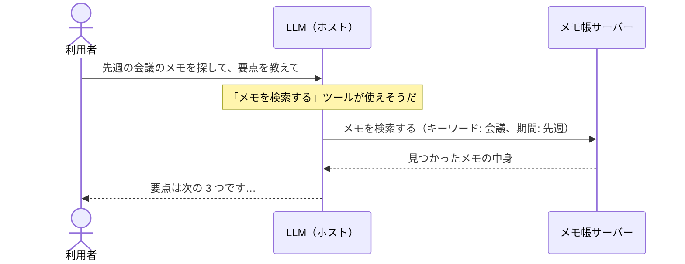
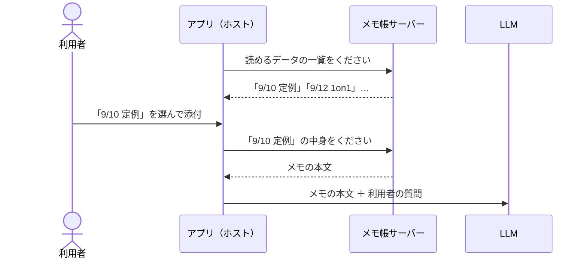
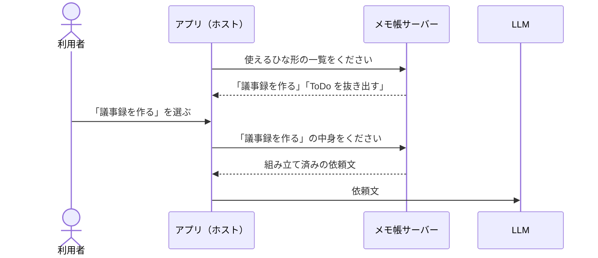

# 03. サーバーが提供する 3 つのもの

MCP サーバーが提供できるものは **ツール・リソース・プロンプト** の 3 種類です。

この章では、**「メモ帳アプリの MCP サーバー」** を例に、3 つがそれぞれ何なのかを見ていきます。
このサーバーを Claude Desktop につないだ場面を想像してください。

## 先に結論

| | ツール | リソース | プロンプト |
| --- | --- | --- | --- |
| **ひとことで** | 実行できる**操作** | 読み込める**データ** | 用意された**依頼文のひな形** |
| **使うと決めるのは** | LLM | 利用者（またはアプリ） | 利用者 |
| **メモ帳の例** | メモを検索する、メモを作る | メモ 1 件の中身 | 「メモから議事録を作る」 |
| **アプリでの見え方** | 会話中に LLM が自動で呼ぶ | 添付メニューで選ぶ | メニューやスラッシュコマンドで選ぶ |

## ツール：LLM が自分で呼ぶ「操作」

### 場面

利用者がチャットで頼みます。

> 「先週の会議のメモを探して、要点を教えて」

すると LLM が**自分で判断して**、サーバーの「メモを検索する」ツールを呼びます。
利用者は、ツールの名前を知らなくても構いません。

### ポイント

- ツールは**「何かをする」もの**。検索する、作る、消す、送る
- **LLM が会話の流れを見て、使うかどうかを決める**
- そのため、ツールには LLM 向けの**説明文**が付いている（「メモをキーワードで検索します」など）。LLM はこれを読んで判断する
- 実際に何かを変更するので、アプリは実行前に**利用者に確認を出す**ことが推奨されている

## リソース：利用者が選んで渡す「データ」

### 場面

利用者が、チャットの添付メニューからメモを選んで会話に入れます。

> （「メモ: 9/10 定例」を添付して）「この内容で合っているか確認して」

選ばれたメモの中身が、**会話の材料として LLM に渡されます**。

### ポイント

- リソースは**「何かのデータ」そのもの**。操作ではない
- 1 件ずつ `memo://2026-09-10` のような**住所（URI）** で指し示す
- **LLM が勝手に取りに行くのではなく、利用者やアプリが「これを使って」と選ぶ**
- 読むだけなので、中身が変わることはない

## プロンプト：利用者が選ぶ「依頼文のひな形」

### 場面

利用者が、メニューから「議事録を作る」を選びます。

> `/議事録を作る`（対象のメモを選ぶ）

すると、サーバーが用意した依頼文（「次のメモから、決定事項・宿題・次回予定を整理した議事録を作ってください…」）が、会話に入ります。

### ポイント

- プロンプトは**「LLM への頼み方」のテンプレート**
- 毎回うまい指示を考えなくても、サーバーの作り手が用意した**よい依頼文をそのまま使える**
- **利用者が明示的に選んだときだけ**使われる

## 3 つを並べて見る

同じ「会議メモから議事録を作りたい」でも、入り方が違います。

| | 利用者がすること | その後に起きること |
| --- | --- | --- |
| **ツール** | 「議事録を作って」と普通に頼む | LLM が自分で判断して、メモの検索ツールを呼ぶ |
| **リソース** | 使いたいメモを添付する | メモの中身が LLM に渡る |
| **プロンプト** | 「議事録を作る」ひな形を選ぶ | 用意された依頼文が LLM に渡る |

見分け方は、**「誰がきっかけを作るか」** です。

- **LLM** が自分から動く → ツール
- **利用者**が「このデータを使って」と選ぶ → リソース
- **利用者**が「この頼み方で」と選ぶ → プロンプト

## よくある疑問

### ツールでデータを返せるなら、リソースはいらないのでは？

実際、多くのサーバーは**ツールだけ**で作られています。
リソースは「利用者が自分で選んだデータだけを LLM に見せたい」ときに向いています。
LLM に探させるならツール、利用者が指定するならリソース、と考えると分かりやすいです。

### アプリによって見え方は違う？

違います。仕様は「どう見せるか」を決めていません。
例えば、プロンプトやリソースに対応していないアプリもあり、**ツールが一番どこでも使える**機能です。

## まとめ

- **ツール** = LLM が自分の判断で呼ぶ**操作**
- **リソース** = 利用者やアプリが選んで渡す**データ**
- **プロンプト** = 利用者が選ぶ**依頼文のひな形**
- 見分け方は「**誰がきっかけを作るか**」
