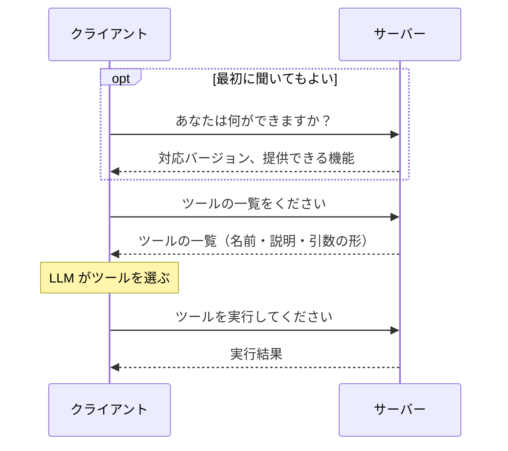
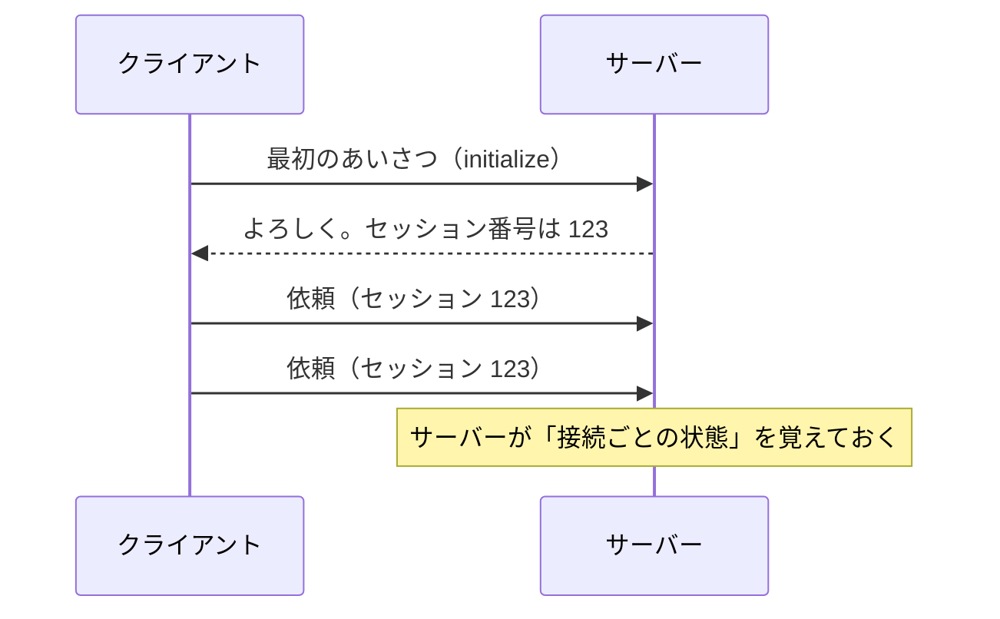
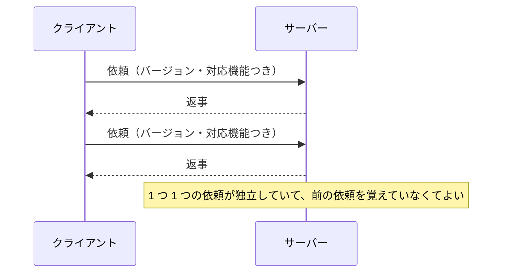
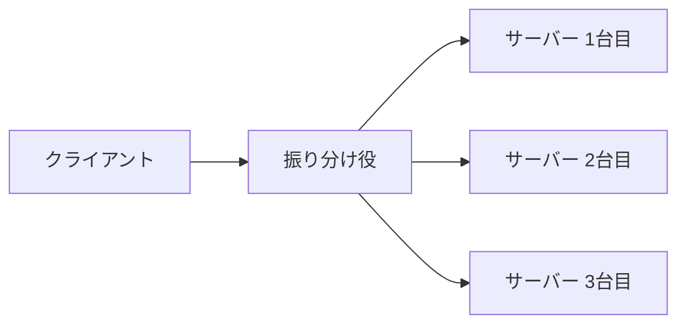
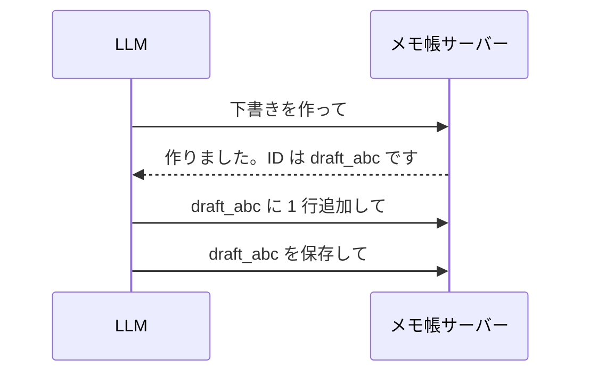
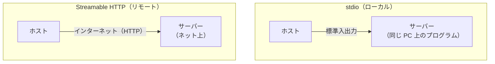

# 04. やり取りの流れと運び方

02 章で見た 2 つの層のうち、この章では

- **データ層**：クライアントとサーバーが、どんなメッセージをどんな順番でやり取りするか
- **トランスポート層**：そのメッセージをどうやって運ぶか

を見ていきます。

## データ層：メッセージは 3 種類

MCP のメッセージは **JSON-RPC** という、JSON で書く単純な形式です。
中身は次の 3 種類だけです。

| 種類 | 意味 | 例え |
| --- | --- | --- |
| **リクエスト** | 「これをやって」という依頼。番号付き | 番号付きの注文伝票 |
| **レスポンス** | 依頼への返事。同じ番号が付く | 「○番のご注文です」 |
| **通知** | 返事のいらないお知らせ | 「ツールの一覧が変わりました」 |

番号が付いているので、複数の依頼を同時に出しても、どの返事がどの依頼のものか分かります。

## データ層：典型的な流れ

1. （任意）サーバーに「何ができるか」を聞く
2. ツールなどの**一覧を取得**する
3. LLM が使うものを選ぶ
4. **実行を依頼**し、結果を受け取る

リソースやプロンプトも、「一覧を取る → 1 つを取得する」という同じ流れです。

## データ層：「何ができるか」を宣言し合う

MCP は、機能を少しずつ追加していける作りになっています。
そのため、お互いに「**自分はこの機能に対応しています**」と宣言し合います。これを **capabilities** と呼びます。

- サーバー：「ツールを提供できます」「リソースもあります」
- クライアント：「利用者への入力依頼（05 章）に対応しています」

**相手が対応していない機能は使わない**、というルールです。
これにより、古いアプリと新しいサーバーのように、対応機能が違う組み合わせでも動きます。

## データ層：最新版はステートレス

2026-07-28 版で、MCP は **ステートレス（状態を持たない）** な作りに変わりました。
MCP の構成を理解するうえで大事な変化なので、新旧を比べます。

### 以前（〜2025-11-25 版）

最初にあいさつをして「セッション」を作り、サーバーはその接続のことを覚えていました。

### 現在（2026-07-28 版）

- 最初のあいさつも、セッションもなくなった
- **毎回の依頼に「バージョン」や「対応している機能」を載せる**
- どの依頼も、それ単体で意味が通る

### なぜステートレスにしたのか

サーバーを**何台にも増やしやすくする**ためです。

セッションがあると、「セッション 123 の依頼は、それを覚えている 1 台目に届けないといけない」という制約が生まれます。
ステートレスなら、**どの依頼をどのサーバーが受け取っても処理できます**。

### 状態が必要なときは？

「さっき作ったものの続きを操作したい」場面もあります。
その場合は、**サーバーが ID を発行し、次からのツール呼び出しの引数で渡してもらう**方法が推奨されています。

ID を覚えておいて次の呼び出しに渡すのは LLM の役目です。
MCP の仕組みとしては、ID は**ただの引数の 1 つ**にすぎません。

## トランスポート層：運び方は 2 種類

メッセージの「中身」は同じで、「どうやって運ぶか」が 2 種類あります。

| | stdio | Streamable HTTP |
| --- | --- | --- |
| サーバーの場所 | 同じ PC | ネット上 |
| 仕組み | ホストがサーバーのプログラムを起動し、標準入出力でやり取りする | サーバーの 1 つの URL に、HTTP で依頼を送る |
| 使う人の数 | 基本はその PC の 1 人 | 多くの人が同時に使える |
| 向いている用途 | 手元のファイル操作、開発ツール | Web サービスとの連携、Web 版のチャットアプリから使う |

### stdio

- ホスト（アプリ）が、サーバーのプログラムを**子プロセスとして起動**する
- アプリがサーバーに書き込み（標準入力）、サーバーが返事を書き出す（標準出力）
- ネットワークを使わないので、シンプルで速い

### Streamable HTTP

- サーバーは **1 つの URL**（例: `https://example.com/mcp`）で待ち受ける
- 依頼は 1 つずつ HTTP で送る
- 返事は「**一度にまとめて返す**」か「**途中経過を流しながら、最後に結果を返す（ストリーミング）**」を選べる
- 時間のかかる処理でも、進み具合を途中で知らせられる

> Web 版のチャットアプリ（ChatGPT など）は、利用者の PC でプログラムを起動できません。
> そのため、こうしたアプリから使うサーバーは Streamable HTTP で作ります。

## バージョンの違いに注意

MCP は仕様が頻繁に更新されています。

- 新しい版（2026-07-28）と古い版（2025-11-25 など）では、やり取りの形が違う
- アプリによって、どの版に対応しているかはまちまち
- 公式の開発キット（SDK）は、古い版のクライアントにも対応できるようになっている

## まとめ

- **データ層**：メッセージは **依頼・返事・通知** の 3 種類。「一覧を取る → 実行する」が基本の流れ
- お互いに **capabilities（対応機能）** を宣言し、対応している範囲で使う
- 最新版は **ステートレス**。状態が必要なら **ID を引数で渡す**
- **トランスポート層**：**stdio（ローカル）** と **Streamable HTTP（リモート）** の 2 種類
