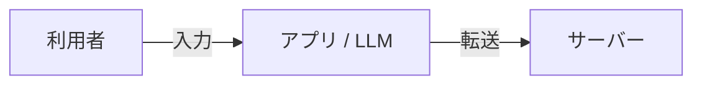
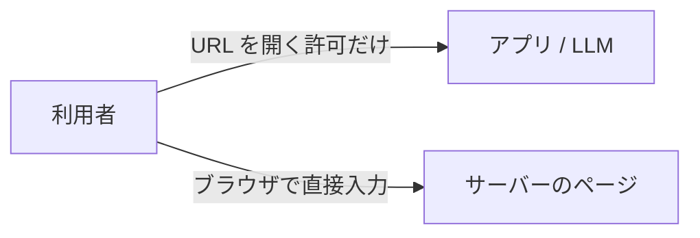
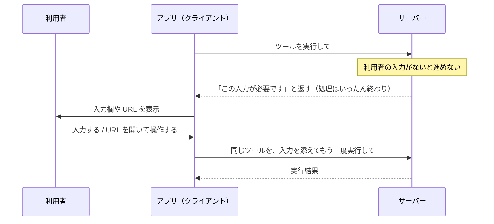

# 05. サーバーから利用者に入力を頼む仕組み

ここまでは「クライアントが頼み、サーバーが応える」流れでした。
しかし、サーバーが処理の途中で「**利用者に聞かないと先に進めない**」こともあります。

- 同じ名前のメモが 2 つある。どちらを使うか選んでほしい
- 外部サービスとの連携に、利用者自身のログインが必要

こうしたときに使うのが **elicitation（エリシテーション）** です。
英語で「引き出す」という意味で、「サーバーが、クライアントを通じて利用者から情報を引き出す」仕組みです。
02 章で見た「**クライアントが提供する機能**」の代表です。

## 2 つのモード

| モード | 何をするか | 使ってよい情報 |
| --- | --- | --- |
| **フォームモード** | アプリの画面に入力欄を出し、利用者に入力してもらう | 選択肢、名前など、**秘密ではない情報** |
| **URL モード** | 利用者に URL を開いてもらい、その先のページで操作してもらう | **パスワード、API キー、決済情報などの秘密情報** |

### いちばん大事なルール

> **パスワードや API キーなどの秘密情報を、フォームモードで聞いてはいけない。**
> **秘密情報が絡むときは、必ず URL モードを使う。**

## なぜ秘密情報は URL モードなのか

フォームモードで入力した内容は、**アプリ（クライアント）を通ってサーバーに届きます**。
その途中で、アプリのログに残ったり、LLM の目に触れたりする恐れがあります。

**フォームモード：入力内容がアプリを経由する**

URL モードなら、利用者は**サーバーのページに直接**入力します。
アプリも LLM も、入力内容を見ることはありません。

**URL モード：入力内容はアプリを経由しない**

## 最新版での流れ：「いったん返して、もう一度頼んでもらう」

2026-07-28 版では、ステートレス（04 章）に合わせて、次のような流れになりました。
この形を **MRTR（Multi Round-Trip Requests：複数往復のリクエスト）** と呼びます。

ポイント:

- サーバーは、途中で待ち続けるのではなく、**「必要なものリスト」を返していったん終わる**
- アプリが利用者から集めて、**元の依頼をやり直す**
- サーバーは、やり直しの依頼だけを見れば続きを処理できる（前の依頼を覚えていなくてよい）

### 例え：役所の窓口

1. 窓口で申請する
2. 「印鑑証明が足りません。取ってきてください」と言われる（いったん終わり）
3. 印鑑証明を取ってくる
4. 最初の申請書に印鑑証明を添えて、もう一度出す
5. 受理される

窓口の人は、2 回目に来たときに 1 回目のことを覚えていなくても、書類を見れば処理できます。

### 以前の版との違い

以前（〜2025-11-25 版）は、サーバーが処理の途中でクライアントに**問い合わせを送り、返事を待つ**形でした。
この形だと、サーバーは返事が来るまで状態を覚えておく必要があります。
ステートレスにするため、「いったん返して、やり直してもらう」形に変わりました。

## 利用者を守るためのルール

**アプリ（クライアント）側**

- どのサーバーが入力を求めているかを、利用者に分かるように表示する
- 利用者が**断れる・キャンセルできる**ようにする
- URL モードでは、開く前に **URL 全体を見せて許可を取る**。勝手に開かない

**サーバー側**

- 利用者が断ったりキャンセルしたりしても、きちんと対応する
- URL に、パスワードや個人情報を入れない
- URL を開いた人が、**依頼を出した本人と同じか確認する**（他人に URL を踏ませる悪用を防ぐため）

## まとめ

- **elicitation** = サーバーが、クライアントを通じて利用者に入力を頼む仕組み
- **フォームモード**は秘密ではない情報、**URL モード**は秘密情報
- 最新版では「必要なものを返す → アプリが集める → やり直す」の **MRTR** で行う
- 利用者が**内容を確認し、断れる**ことが大前提
