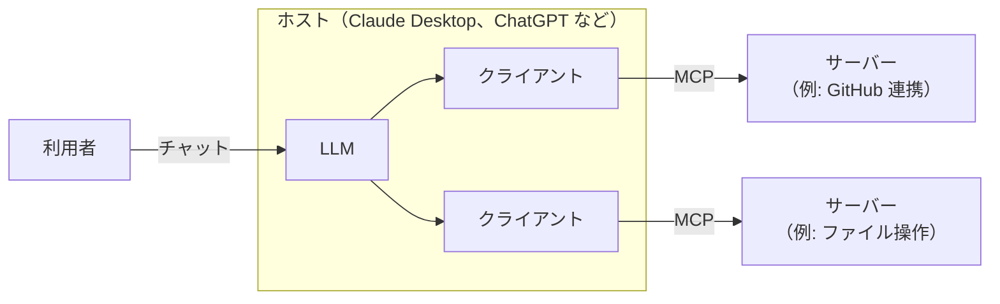

# MCP 勉強ノート

MCP（Model Context Protocol）の**概念**と、**どういう構成で組まれているか**をまとめたノートです。

- 基準にした仕様: 2026-07-28 版（2026-09 時点の最新）
- 一次情報: <https://modelcontextprotocol.io>

## 読む順番

| # | ノート | 分かること |
| --- | --- | --- |
| 1 | [01-what-is-mcp.md](01-what-is-mcp.md) | MCP とは何か、なぜ必要なのか |
| 2 | [02-architecture.md](02-architecture.md) | 全体の構成。登場人物と、2 つの層 |
| 3 | [03-server-features.md](03-server-features.md) | サーバーが提供する 3 つのもの（ツール・リソース・プロンプト） |
| 4 | [04-communication.md](04-communication.md) | クライアントとサーバーのやり取りの流れと、運び方 |
| 5 | [05-asking-the-user.md](05-asking-the-user.md) | サーバーから利用者に入力を頼む仕組み |
| - | [glossary.md](glossary.md) | 用語集 |

## 一枚で見る MCP

- **ホスト**は LLM アプリ本体
- **クライアント**はホストの中の接続係。サーバー 1 つにつき 1 つある
- **サーバー**は「ツール」「リソース」「プロンプト」を提供する
